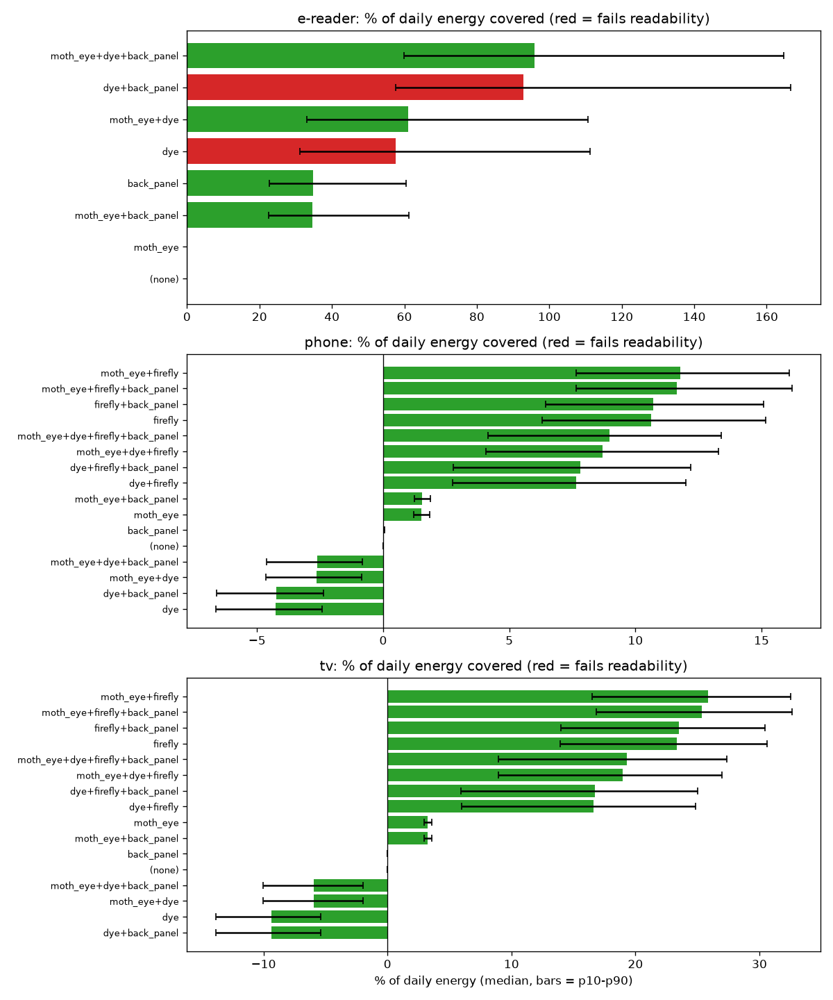
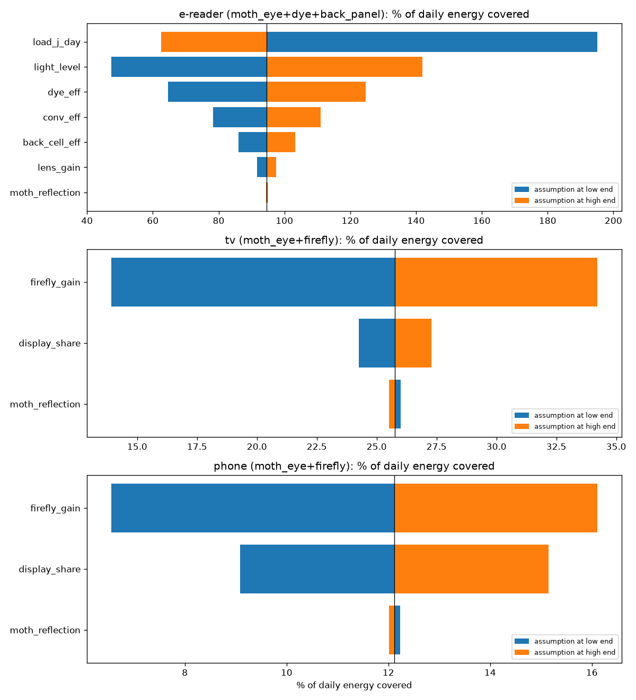
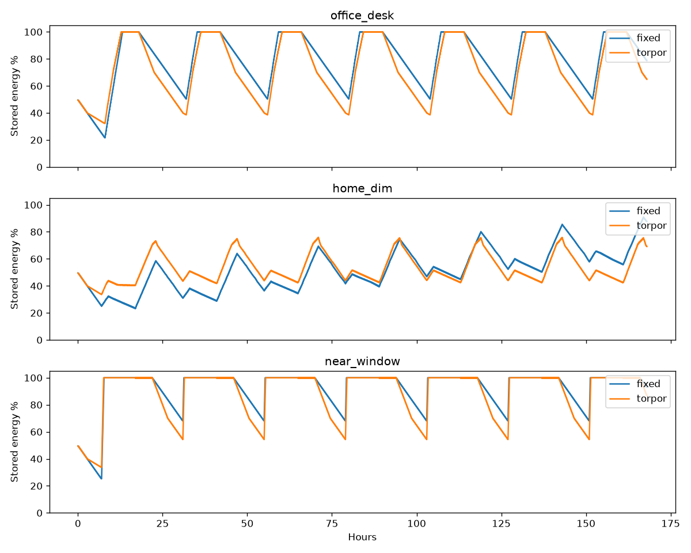

# Bio-Inspired Solar Screen

An energy model for screens that borrow tricks from nature to harvest light and waste less of it: moth eyes, firefly lanterns, photosynthetic antennas, fly compound eyes, and hummingbird torpor.

The question it answers: **which nature-inspired layers actually pay for themselves, and on which kind of device?**

## Key findings (simulation, assumption ranges)

| Device | Best stack | Daily energy covered (median) | Biggest uncertainty |
|---|---|---|---|
| E-reader | moth eye + dye antenna + compound-eye back panel | ~96% | device's own daily energy use, then room brightness |
| Phone | moth eye + firefly extraction | ~12% | firefly extraction gain |
| TV | moth eye + firefly extraction | ~26% | firefly extraction gain |

1. **Harvesting on bright, emissive screens is a net loss.** A transparent dye (antenna) layer on a phone harvests about 24 J/day but dims the screen, and compensating costs about 2,100 J/day. On a TV it loses about 9% of daily energy.
2. **For phones and TVs the win is saving, not harvesting.** Firefly-lantern light extraction cuts display energy enough to cover roughly 11% (phone) and 23% (TV) of daily use.
3. **Two nature ideas rescue each other on e-readers.** The dye layer alone drops readability to 81%; adding the moth-eye texture brings it back to 87% while keeping the harvest.
4. **Adaptive "torpor" scheduling keeps dim-room devices alive.** In a dim home, 42% of simulated e-paper devices fail with a fixed 10-minute refresh. Adapting the refresh rate to stored energy makes all of them survive, with slightly more updates per day.

## Charts

**Layer stacks per device** (`src/stack_config.py`)


**Which assumptions matter most** (`src/sensitivity.py`)


**7-day stored energy, fixed vs torpor policy** (`src/day_sim.py`)


## Nature ideas used

| Idea | Source in nature | Role |
|---|---|---|
| Anti-reflection texture | Moth eye | Less glare, more light in, less brightness needed |
| Transparent dye layer | Photosynthetic antenna | Catches light, guides it to edge cells |
| Light-extraction texture | Firefly lantern | More light out of an OLED per watt |
| Micro-lens back panel | Fly compound eye | Wide-angle light capture |
| Adaptive refresh | Hummingbird torpor | Spend energy when rich, hibernate when low |

## Run it

```bash
python3 -m venv .venv && source .venv/bin/activate
pip install numpy pandas matplotlib
python3 src/day_sim.py        # 7-day duty-cycle + torpor policy
python3 src/stack_config.py   # which layers pay off per device
cd src && python3 sensitivity.py   # which assumptions matter most (run after stack_config)
```

Outputs go to `docs/`. `src/simulate.py` is the first-pass model, kept for history; its indoor numbers were about 2.6x too high (daylight conversion used for LED light), fixed in the later files.

## Honest limits

- Every device and material number is an **assumption range** from published lab results, not a measurement. Results are sampled with Monte Carlo and shown as ranges.
- The best reflective colour display result (video-rate, 2025) is a millimetre-scale lab sample; the moth-eye film's long-term durability is unproven.
- Adaptive duty cycling is known in energy-harvesting research. What this project adds is testing it together with a bio-inspired display stack, per device type.
- Light profiles are simplified daily schedules.

## Roadmap

- [x] M1: first-pass energy budget
- [x] M2: 7-day duty-cycle simulation with torpor policy
- [x] M3: layer-stack configurator per device
- [x] M4: sensitivity analysis and write-up
- [ ] M5: bench prototype (ESP32, e-paper, indoor cell, current sensor) to replace the top assumptions with measurements
