# Bio-Inspired Solar Screen

An open, tested energy model for screens that borrow from nature: moth eyes, firefly lanterns, leaf antennas, chameleons, hummingbird torpor, bee colonies and the sun and moon. It works for **any screen device**: e-readers, shelf labels, smartwatches, phones, tablets and TVs.

**Live demo:** https://shehab6157-design.github.io/bio-inspired-solar-screen/ — includes a **"Score your screen"** tool: describe any screen and get its Light-Life grade and the nature layer that would improve it most.

The question it answers: **which nature-inspired ideas actually save energy or keep a screen working, on which device, and what do they cost?** Every answer comes from simulation with honest uncertainty ranges, and the key results are tested on **real sunlight data** from four cities.

---

## The problem

- Screens are the biggest energy user in most personal devices, and in TVs almost the only one.
- Phones become hard to read in sunlight, boost their brightness to fight the glare, overheat, and then dim or shut down exactly when you need them.
- Every notification wakes a phone, even when another screen is right in front of you.
- Small light-powered screens (e-paper labels, sensors) die in dark rooms and dark winters.

## The idea: layers from nature, working as one organism

| Layer | Inspired by | What it does |
|---|---|---|
| Anti-glare texture | Moth eye | Cuts reflection from 4.4% to under 1%, so the screen needs less brightness |
| Light extraction | Firefly lantern | Gets more light out of an OLED per watt |
| Invisible-band harvesting | Photosynthetic antenna / purple bacteria | Harvests near-infrared light the eye doesn't use |
| Reflective / glowing switch | Chameleon, and the sun and moon | Reflects room light when it's bright (like the moon), glows only in the dark (like a lamp) |
| Heat mirror | "Two seas that do not mix" | Reflects the sun's invisible heat while visible light passes |
| Energy pacing | Hummingbird torpor | Slows down when stored energy is low |
| Rhythm planning | Circadian and weekly rhythms | Learns daily and weekly light patterns and plans ahead |
| Shared budget | A body's metabolism | One energy plan decides screen mode, brightness and updates |
| Household colony | Honeybee division of labour | Sends each message to the best-placed screen; tired screens decline work |
| Light eye | Animal eyes that see beyond visible light | Reads the screen's own visible and infrared layers to tell daylight from lamp light, with no extra parts |

---

## Headline results

These come from `src/organism.py`, which stacks the layers one at a time on a real day of use.

### Phone: one office worker's day

| Layer added | Screen + message energy | Saved | Phone wake-ups |
|---|---|---|---|
| Today's phone | 6,300 J | 0% | 73 |
| + moth eye, no polarizer | 4,530 J | 28% | 73 |
| + firefly extraction | 3,438 J | 45% | 73 |
| + moon mode | 2,530 J | 60% | 73 |
| **+ hive** | **2,004 J** | **68%** | **3** |

### Phone: one hour in summer sun

| Phone | Peak temperature | Unreadable minutes (of 60) |
|---|---|---|
| Today | 51 °C | 54 |
| **Heat mirror + moon mode** | **44 °C** | **0** |

### TV: 4 hours an evening

**50.9 → 26.7 kWh a year (48% less)** with moth eye, no polarizer, and firefly extraction.

### E-reader: 6 Wh battery, 2.5 hours of reading a day

**5.5 → 31.3 days per charge**: glowing only → chameleon → unified glide path.

### The Light-Life Score: rating screens the way people use them

Official energy tests measure a screen's power at a few fixed room-light levels in a lab. They never check whether the picture can actually be read against glare, and they never go outdoors. The **Light-Life Score** runs a screen through a day of real light, from a dark bedroom to full sun, and measures **energy per hour the screen is actually readable**, graded A to G.

| Screen | Energy per readable hour | Readable | Grade |
|---|---|---|---|
| Phone today (polarizer OLED) | 0.35 Wh | 100% | D |
| Phone, polarizer-free | 0.31 Wh | 92% | **D!** (unreadable in full sun) |
| Phone, polarizer-free + moth eye | 0.23 Wh | 100% | D |
| **Phone, full bio-stack** | **0.09 Wh** | 100% | **B** |
| Reflective colour screen + front light | 0.15 Wh | 100% | C |
| TV today | 44.1 Wh | 100% | E |
| TV, polarizer-free + moth eye + firefly | 23.2 Wh | 100% | D |

A power-only test would rank the polarizer-free phone above today's phone; the score catches that it saves power by being unreadable in the sun.

### Home screens on real winter light

| Result | Finding |
|---|---|
| Placement map | A fixed-schedule light-powered screen survives winter only right by a window (3% daylight). Adaptive control keeps it alive to the back of the room (0.5% daylight): about 6 times less light. |
| Hive across climates | Bee response thresholds cut the time an e-paper can't update from 13.7% to 2.1% (London), 13.1% to 1.9% (Berlin) and 50.9% to 27.5% (Oslo). Not needed in northern Israel (0%). |

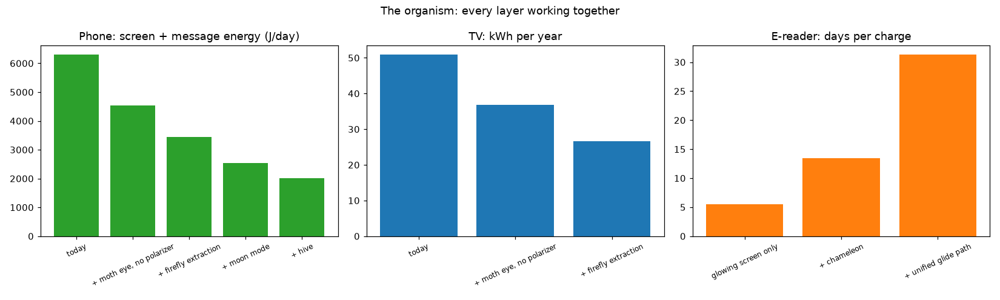

---

## Results layer by layer

**Glare and the polarizer (phones, TVs)** — `src/polarizer.py`
Removing the polarizer saves about 25% in dim rooms, matching the industry's reported figures. Alone, it becomes unreadable in strong sun once the panel's internal reflection reaches 2%. With the moth eye, it stays readable up to 4% and still saves 32–57%: **the moth eye doubles the design window.** A real polarizer-free panel has a total reflectance of 6.41%, inside this window.
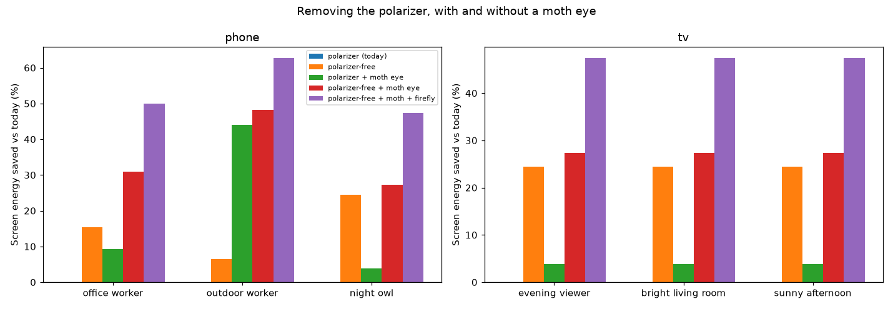

**Heat in the sun (phones)** — `src/two_seas.py`
Sunlight puts about 6.5 W of heat into a phone's face, several times the chip's 1.5 W. A heat mirror cuts that to 4 W and halves screen-off time. Switching to reflective "moon" mode outdoors reflects visible sunlight too, keeping the phone readable for the whole hour.
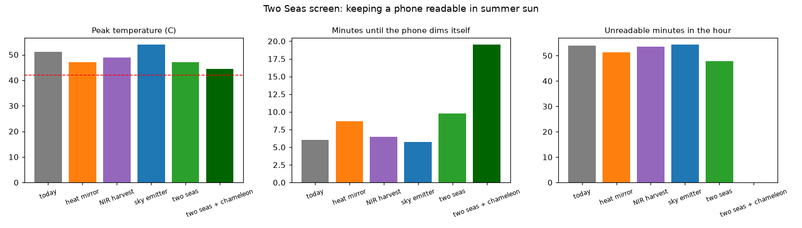

**Unified glide path (e-readers)** — `src/unified.py`
One plan, drawn as a straight line from a full battery to a 5% reserve on the chosen charge day, decides screen mode and syncing. Cost: about 1.6 hours a day on the cheaper front-lit look.
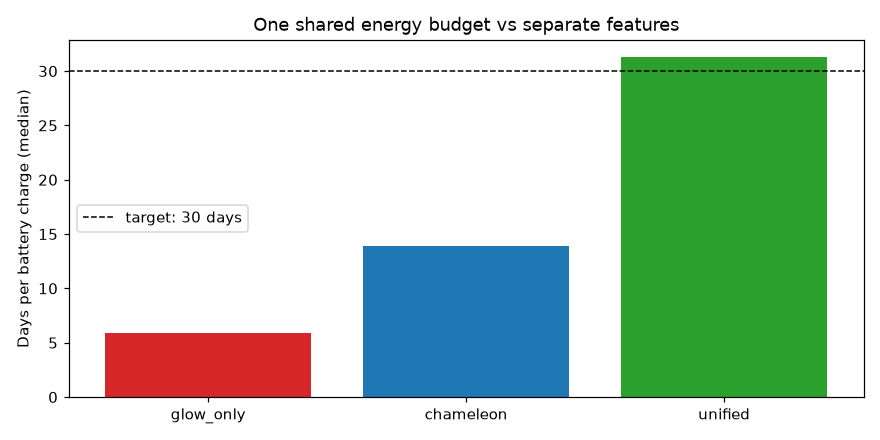

**Evolved settings** — `src/evolve.py`
A genetic algorithm maps the full trade-off between battery life and reading comfort. It found no design better than the hand design on both goals at once, which validates the hand design, and showed that only one setting (how far ahead the plan looks) really matters.
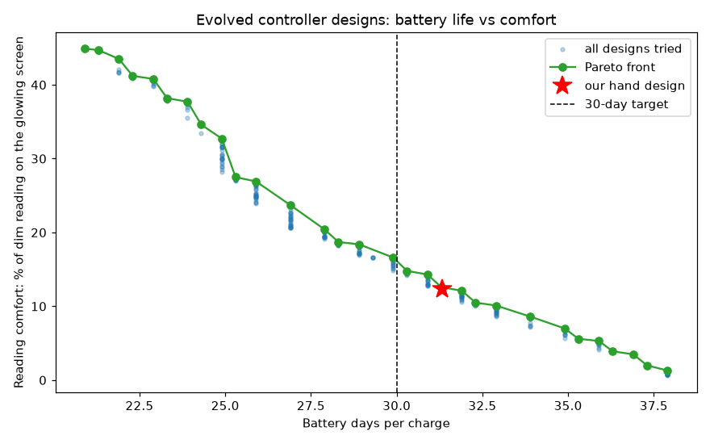

**Circadian planning** — `src/circadian.py`
With offices dark at weekends, reactive torpor lets 75% of devices fail; the weekday-learning controller keeps 100% alive after its first week.
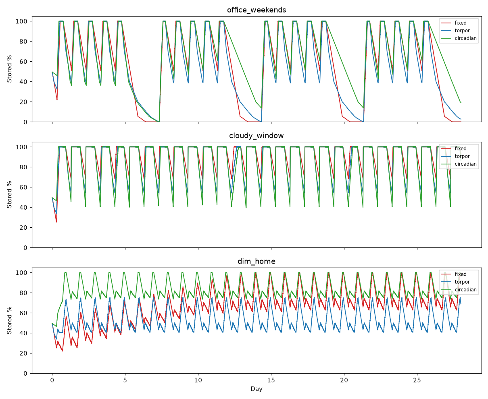

**Real sunlight** — `src/real_data.py`, `src/placement.py`, `src/climates.py`
Hourly 2020 data from PVGIS (European Commission). Real winter near a window gets 61–72% of the light the early models assumed; summer gets up to 194%. **Winter is the true bottleneck.**
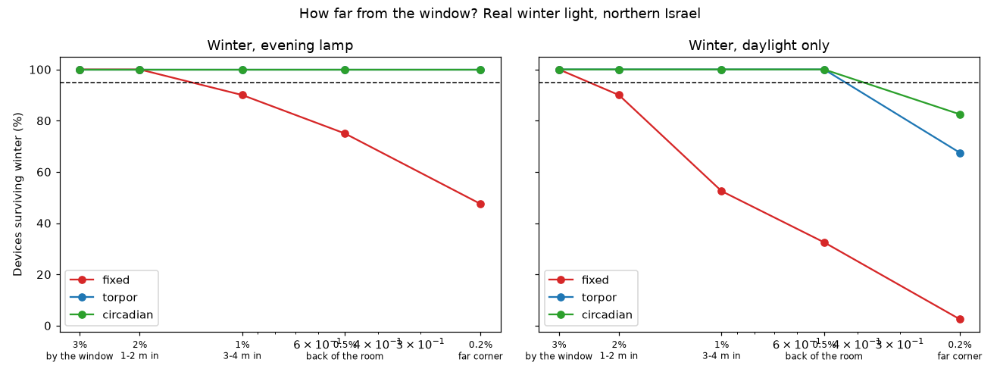
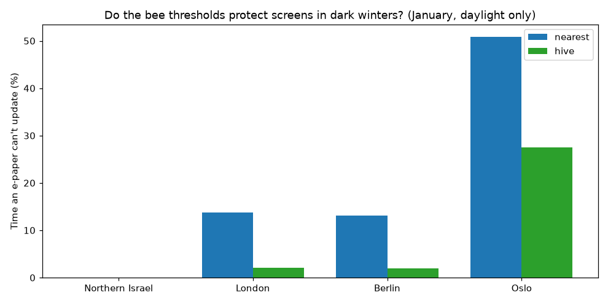

**Hive screens** — `src/hive.py`
Routing messages to the best-placed screen cuts phone wake-ups by 96% and message energy by 92%, with every message on time.
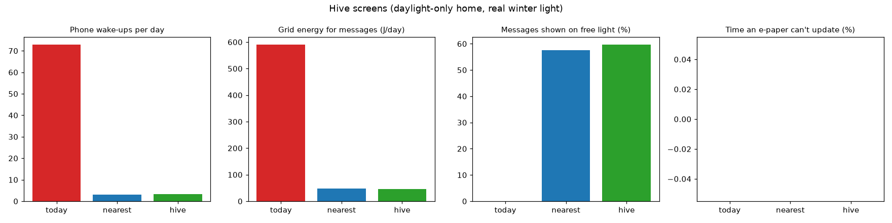

**Light-Life Score** — `src/light_score.py`
One number for any screen: energy per readable hour across a realistic day of light, with a "!" when a screen is readable less than 95% of the time.
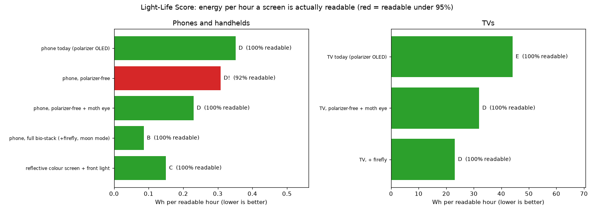

**Light eye** — `src/light_eye.py`
LED light carries almost no infrared (0.004 per unit of visible light); sunlight carries a lot (0.87). Reading both bands, the eye identifies daylight through a window **100%** of the time, even through low-e glass, where a normal one-band light sensor gets it right only about **40%** of the time. It gives sensor-less devices, like shelf labels, free sensing.
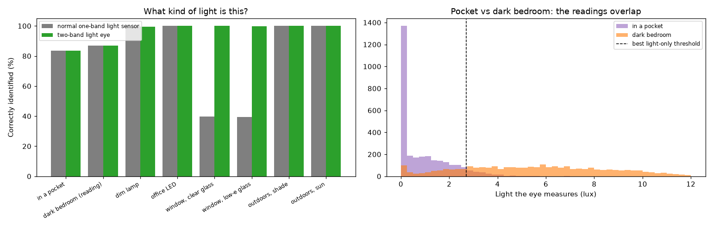

**Weather-aware planning and the waggle dance** — `src/waggle.py`
Home e-papers that learn their normal day and notice when *today* is darker fail far less: the darkest screen in a home can't update 4.4% of the time in a London January instead of 12.5% with torpor, and 1.6% instead of 10% in Berlin. Sharing the window screen's weather reading with the others (the "waggle dance") adds nothing measurable, because every room sees the same outdoor weather, only dimmer.
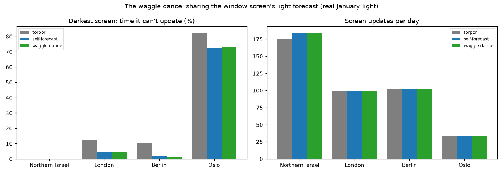

**Invisible-band harvesting** — `src/spectral.py`
A dye layer tuned to near-infrared stops dimming the screen, but room LED light has almost no infrared, so indoors it gains almost nothing. It helps only devices used in daylight.
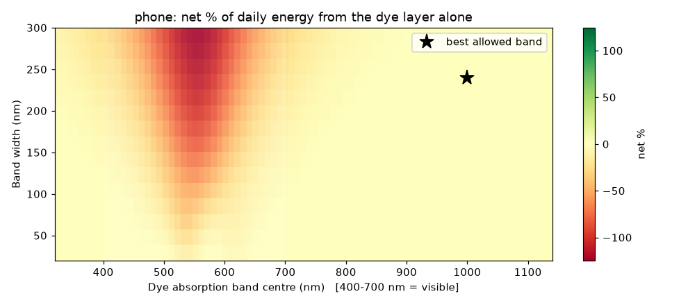

---

## What didn't work (and why that matters)

- **Harvesting light on glowing screens is a net loss.** A dye layer on a phone harvests about 24 J a day but dims the screen, and brightening it back costs about 2,100 J.
- **Harvesting the sun's heat doesn't cool a phone.** Absorbing infrared to make power leaves most of it as heat. For heat, **reflecting beats harvesting.**
- **A sky-cooling layer makes a phone hotter** (54 °C vs 51 °C). Phone glass already radiates heat well; sky coolers help things get colder than the air, not hot objects.
- **Predictive planning helps only at the edges.** On real winter light, reactive torpor already works; prediction adds survival only in the darkest spots.
- **Bee thresholds are unnecessary in sunny climates.** They earn their place only where winters are dark.
- **The waggle dance didn't help.** Screens sharing a light forecast did no better than each screen reading its own light. The lesson from nature here is "sense and plan for the day," not "communicate."
- **Light alone can't tell a pocket from a dark bedroom.** The best light-only rule catches 93% of pockets but mistakes 19% of dark-bedroom readings for a pocket, which would switch the screen off while someone reads in bed. For that decision the light eye must team up with a proximity sensor.

---

## What's new and what's borrowed

A prior-art search found that **every individual mechanism already exists**:

- Moth-eye structures on polarizer-free OLED panels: patented (e.g. US 12,284,897).
- Switching a hybrid screen to reflective mode in sunlight: patented (e.g. US 11,204,657).
- Routing notifications to the most suitable device: patented (e.g. WO 2021/164554).
- Energy-harvesting devices planning around office schedules: patented (e.g. US 9,791,910).
- Transparent infrared-harvesting layers and infrared-reflecting films: published and commercial.

**What this project adds:**

1. **One open, tested model that runs all these mechanisms together** for any screen device, including how they interact. The patents each cover one mechanism.
2. **Quantified findings not found in the searched literature:** the moth eye doubling the design window for polarizer-free panels; reflecting beating harvesting for phone heat; sky coolers heating phones; adaptive control surviving 6 times deeper into a room on real winter light; bee thresholds mattering only in dark climates.
3. **A configurator:** describe any device in a small JSON file (`devices/`) and get its best stack and its trade-offs.
4. **The Light-Life Score, a proposed metric:** today's standard tests (for example ENERGY STAR and IEC 62087) average a screen's power at fixed room-light levels. This score adds readability against glare and outdoor light to the rating. It is a proposal, not an adopted standard.

This is a design and analysis tool, not a claim to have invented the individual mechanisms. The search was not a legal opinion.

---

## How it's built

| Script | What it models |
|---|---|
| `day_sim.py` | 7-day duty-cycle simulation with torpor |
| `stack_config.py` | Which layers pay off per device |
| `sensitivity.py` | Which assumptions matter most |
| `chameleon.py` | Reflective / glowing switching |
| `configure.py` | Any-device configurator (`devices/*.json`) |
| `spectral.py` | Wavelength-by-wavelength light and eye sensitivity |
| `circadian.py` | Predictive weekday-rhythm controller |
| `unified.py` | One shared energy plan (glide path) |
| `evolve.py` | Genetic optimizer, Pareto front |
| `real_data.py` | A real year of sunlight (PVGIS) |
| `placement.py` | Winter survival by distance from a window |
| `hive.py` | Household screens as a bee colony |
| `climates.py` | The hive in Israel, London, Berlin and Oslo |
| `polarizer.py` | Polarizer-free OLED + moth eye |
| `two_seas.py` | Phone temperature in summer sun |
| `light_score.py` | Light-Life Score: energy per readable hour for any screen |
| `light_eye.py` | Two-band sensing from the screen's own layers |
| `waggle.py` | Weather-aware planning, with and without a shared forecast |
| `organism.py` | All layers together, device by device |

**89 automated tests** in `tests/` check the physics and behaviour rules (for example: no light means no harvest; removing the polarizer matches the industry's reported saving; the moth eye keeps a polarizer-free phone readable in strong sun).

## Run it

```bash
python3 -m venv .venv && source .venv/bin/activate
pip install numpy pandas matplotlib pytest

# real sunlight data (free, no account)
curl -s "https://re.jrc.ec.europa.eu/api/v5_2/seriescalc?lat=32.69&lon=35.42&startyear=2020&endyear=2020&outputformat=csv" -o data/pvgis_2020.csv
# the London, Berlin and Oslo lines are at the top of src/climates.py

./run_all.sh --quick   # about 2 minutes
./run_all.sh           # everything, about 20-30 minutes
```

## Honest limits

- Every material and device number is an **assumption range** from published results, sampled with Monte Carlo. Nothing here is a hardware measurement.
- The phone total in the organism stacks layers that were each modelled separately; it is a model estimate, not a measured phone.
- The reflective colour display assumed for moon mode is still a lab-stage technology, and the long-term durability of moth-eye films is unproven.
- Real sunlight comes from one year (2020); room positions and distances are typical, and real rooms vary a lot.

## Next steps

- **Lab validation:** the clearest testable prediction is the moth eye's effect on polarizer-free panels. It could be checked by an optics lab with a real panel and a moth-eye film.
- **An open configurator** for manufacturers, built on `configure.py`.
- **A real light diet:** replace the Light-Life Score's assumed day of light with light logged by volunteers' phones, building an open dataset of the light screens actually live in.

## Inspiration

The science of light and vision this project stands on began with Ibn al-Haytham's *Book of Optics*. The Quran's invitation to reflect on creation (3:190–191) shaped the approach, and some of its images map directly onto the design: the sun as a lamp and the moon as a light that reflects (71:16, 10:5) — the difference between a glowing and a reflective screen; two seas that meet without mixing (55:19–20) — one surface where different parts of the light keep to their own jobs; everything moving on a set course (36:38–40) — predictable rhythms a device can plan around.

## Data

Sunlight data: PVGIS (Photovoltaic Geographical Information System), European Commission Joint Research Centre, SARAH-2 database, 2020.

## Author

Shehab Shibli — [GitHub](https://github.com/shehab6157-design) · [LinkedIn](https://www.linkedin.com/in/shehab-shibli)
